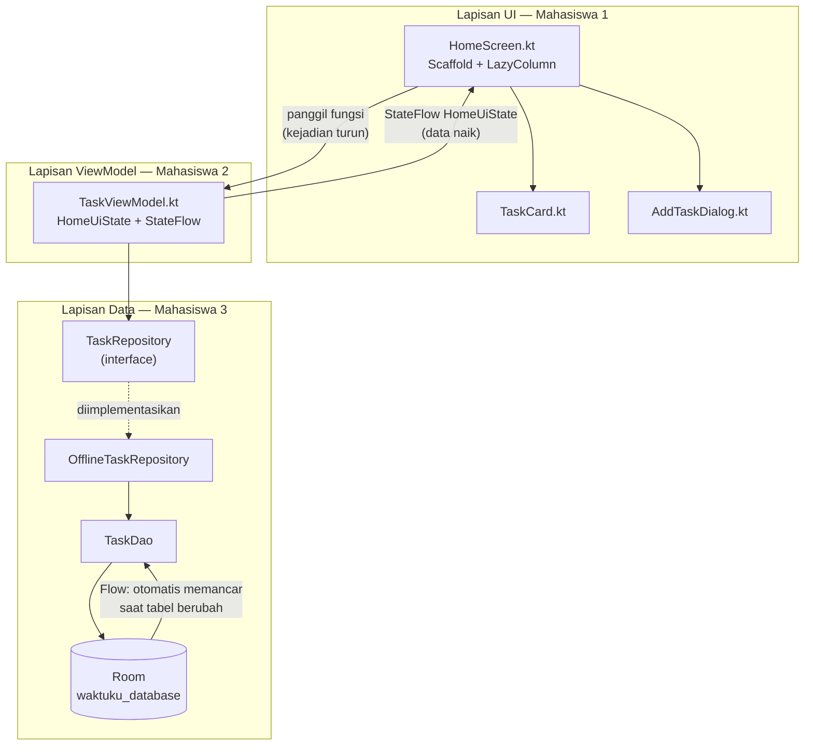
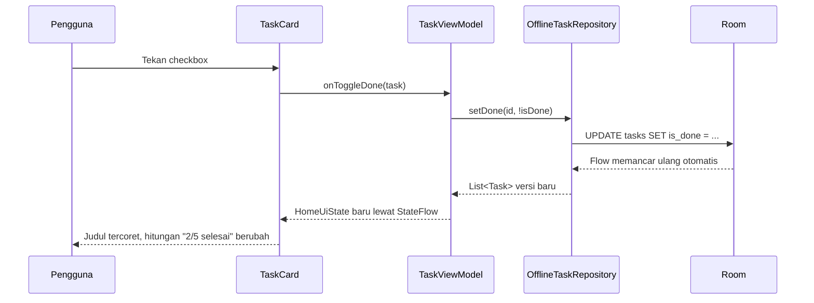

# Dokumentasi Fondasi WaktuKu

Dokumen ini menjelaskan **apa saja yang dibangun pada tahap kick-off**, alasan di
balik setiap keputusan teknis, dan bahan untuk mempertanggungjawabkannya saat
presentasi.

Status: seluruh kode di dokumen ini sudah diverifikasi lolos kompilasi
(`BUILD SUCCESSFUL`), bukan sekadar kerangka di atas kertas.

---

## 1. Ringkasan

| | |
|---|---|
| Nama aplikasi | WaktuKu — Personal Planner & Pomodoro Timer |
| Jenis | Android luring (offline), tanpa server dan tanpa internet |
| Bahasa | Kotlin murni |
| Arsitektur | MVVM + Unidirectional Data Flow |
| Acuan struktur | [android/compose-samples](https://github.com/android/compose-samples) (pola JetNews) |
| Total kode | 15 file Kotlin, 1.363 baris (termasuk komentar penjelasan) |
| Cakupan tahap ini | Fitur **Task** (CRUD + filter). Fitur Pomodoro menyusul di sprint berikutnya. |

---

## 2. Daftar file yang dibuat

### Lapisan Data — Mahasiswa 3

| File | Baris | Isi |
|---|---|---|
| `model/Task.kt` | 73 | `data class Task` sebagai `@Entity` tabel `tasks`, plus `enum TaskPriority` |
| `data/TaskDao.kt` | 73 | Kumpulan query SQL: `observeAll()`, `upsert()`, `delete()`, `updateDoneStatus()`, `deleteCompleted()` |
| `data/TaskConverters.kt` | 29 | `@TypeConverter` penerjemah `TaskPriority` ⇄ `TEXT` |
| `data/TaskRepository.kt` | 94 | `interface TaskRepository` + `class OfflineTaskRepository` |
| `data/WaktuKuDatabase.kt` | 66 | `@Database` versi 1, singleton dengan `@Volatile` + `synchronized` |
| `data/AppContainer.kt` | 38 | Dependency Injection manual (perakit objek) |

### Lapisan ViewModel — Mahasiswa 2

| File | Baris | Isi |
|---|---|---|
| `ui/viewmodel/TaskViewModel.kt` | 181 | `enum TaskFilter`, `data class HomeUiState`, `TaskViewModel` (combine + stateIn), dan `ViewModelProvider.Factory` |

### Lapisan UI — Mahasiswa 1

| File | Baris | Isi |
|---|---|---|
| `ui/screens/HomeScreen.kt` | 345 | `Scaffold` + `TopAppBar` + `LazyColumn` + chip filter + `EmptyState` + `LoadingState` + 2 `@Preview` |
| `ui/components/TaskCard.kt` | 189 | Kartu satu tugas: checkbox, judul tercoret bila selesai, catatan, meta (prioritas · tenggat · sesi), tombol hapus |
| `ui/components/AddTaskDialog.kt` | 117 | Dialog tambah tugas: input judul + pilihan prioritas, tombol Simpan nonaktif bila judul kosong |

### Perekat & tema

| File | Isi |
|---|---|
| `WaktuKuApplication.kt` | Kelas `Application`, pemilik `AppContainer` seumur hidup aplikasi |
| `MainActivity.kt` | Satu-satunya Activity (pola *single-activity*) |
| `ui/theme/` | `WaktuKuTheme`, warna, tipografi (Material 3 + dynamic color) |

### Konfigurasi

| File | Perubahan |
|---|---|
| `gradle/libs.versions.toml` | Version catalog: Room 2.8.4, KSP 2.2.10-2.0.2, Lifecycle 2.11.0, material-icons-core |
| `app/build.gradle.kts` | Plugin KSP, namespace & applicationId `com.kelompok.waktuku`, dependensi Room/Lifecycle |
| `gradle.properties` | `android.disallowKotlinSourceSets=false` (lihat bagian 7) |
| `.gitignore` | Mengabaikan `local.properties`, `.idea/`, `.gradle/`, `build/`, dan file keystore |

---

## 3. Arsitektur



Intinya **Unidirectional Data Flow**: kejadian dari pengguna turun ke bawah lewat
pemanggilan fungsi, data naik ke atas lewat `Flow`. Tidak ada jalan pintas —
UI tidak pernah menyentuh `TaskDao`, dan ViewModel tidak pernah tahu soal Compose.

### Contoh alur nyata: pengguna mencentang sebuah tugas



Perhatikan: **tidak ada satu baris pun kode "refresh"**. UI berubah karena
datanya berubah, bukan karena disuruh menggambar ulang. Ini poin terkuat untuk
ditunjukkan saat demo.

---

## 4. Keputusan desain dan alasannya

Bagian ini yang paling berguna saat ditanya "kenapa begitu?".

**Tenggat disimpan sebagai `Long` (epoch millis), bukan `String`.**
Hanya angka yang bisa diurutkan dan difilter dengan benar langsung di SQL.
Kalau disimpan sebagai teks `"12 Maret 2026"`, query `ORDER BY` akan mengurutkan
menurut abjad — Maret bisa muncul sebelum Februari.

**Satu `HomeUiState`, bukan banyak `StateFlow` terpisah.**
Mustahil muncul kondisi janggal seperti `isLoading = true` padahal daftar tugas
sudah terisi, karena semua nilainya berubah bersamaan dalam satu objek. Ini pola
*UI state as a single source of truth* dari panduan arsitektur resmi Google.

**`Repository` dibuat sebagai interface, bukan langsung kelas.**
Dua manfaat: (1) kalau nanti WaktuKu menambah sinkronisasi cloud, hanya file
implementasi yang berubah — ViewModel dan UI tidak tersentuh; (2) saat menguji
`TaskViewModel`, kita bisa memasukkan `FakeTaskRepository` tanpa perlu database asli.

**Dependency Injection manual (`AppContainer`), bukan Hilt.**
Untuk aplikasi seukuran ini, seluruh alur perakitan objek terlihat kasat mata —
tidak ada kode yang "muncul dari anotasi". JetNews di compose-samples pun memakai
pendekatan yang sama. Hilt baru sepadan ketika jumlah layar dan dependensi
sudah banyak.

**`stateIn(..., SharingStarted.WhileSubscribed(5_000))`.**
Aliran data dihentikan 5 detik setelah layar tidak terlihat, supaya database
tidak terus dibaca di latar belakang. Jeda 5 detik itu disengaja: saat pengguna
hanya memutar layar, langganan tidak sempat putus sehingga tidak ada pembacaan
ulang yang sia-sia.

**`HomeScreen` dipecah jadi versi *stateful* dan *stateless*.**
Versi stateless hanya menerima `HomeUiState` dan lambda, sehingga bisa
di-`@Preview` dan diuji **tanpa database dan tanpa emulator**. Versi stateful
cuma bertugas mengambil state dari ViewModel lalu meneruskannya.

**`key = { task.id }` pada `LazyColumn`.**
Tanpa key, saat sebuah tugas dihapus Compose bisa salah mencocokkan item dan
tampilannya terlihat "loncat" atau salah data.

**Teks yang sedang diketik disimpan di Composable, bukan di ViewModel.**
Teks setengah jadi belum berarti apa-apa bagi aplikasi; ia baru menjadi data
setelah tombol Simpan ditekan. Mengirim setiap ketukan huruf ke ViewModel hanya
membuatnya bekerja puluhan kali tanpa manfaat.

**Aturan pembatas antar anggota:**
`TaskViewModel` tidak boleh mengimpor apa pun dari `androidx.compose.*`, dan
Composable tidak boleh mengubah `uiState` langsung. Kalau aturan ini dilanggar,
artinya ada logika yang bocor melewati batas lapisan.

---

## 5. Pembagian tugas

| Anggota | Lapisan | Folder | File |
|---|---|---|---|
| Mahasiswa 1 | UI/UX Jetpack Compose | `ui/screens`, `ui/components`, `ui/theme` | 3 file, 651 baris |
| Mahasiswa 2 | State & logika | `ui/viewmodel` | 1 file, 181 baris |
| Mahasiswa 3 | Local storage Room | `model`, `data` | 6 file, 373 baris |

Batas folder ini dipilih agar tiga orang bisa bekerja bersamaan tanpa menyunting
file yang sama, sehingga konflik Git minimal.

---

## 6. Verifikasi

```bash
./gradlew :app:assembleDebug :app:testDebugUnitTest
```

Hasil: **BUILD SUCCESSFUL**

- `:app:kspDebugKotlin` lolos — KSP berhasil membangkitkan kode Room dari anotasi
- `:app:compileDebugKotlin` lolos tanpa warning dari kode kita
- `:app:testDebugUnitTest` lolos
- APK debug tergenerate di `app/build/outputs/apk/debug/app-debug.apk` (12 MB)

---

## 7. Kendala teknis yang ditemukan dan cara mengatasinya

Proyek ini memakai AGP 9.3.2 yang masih sangat baru, sehingga banyak tutorial Room
di internet akan gagal di sini. Tiga masalah berikut sudah ditemukan dan ditambal
saat verifikasi build.

**a. KSP belum akur dengan "built-in Kotlin" milik AGP 9**

Pesan errornya:
```
Using kotlin.sourceSets DSL to add Kotlin sources is not allowed with built-in Kotlin
```
AGP 9 kini membawa Kotlin sendiri dan melarang plugin lain menambah folder sumber
lewat `kotlin.sourceSets` — padahal itulah cara KSP mendaftarkan kode Room hasil
generate. Solusinya memakai sakelar resmi Google di `gradle.properties`:
```properties
android.disallowKotlinSourceSets=false
```
Baris ini boleh dihapus setelah KSP merilis versi yang mendukung built-in Kotlin.

**b. Pustaka ikon tidak lagi terbawa otomatis**

Compose BOM versi baru tidak lagi menarik ikon lewat `material3`, sehingga muncul
`Unresolved reference: Icons`. Perbaikannya menuliskan dependensinya secara
eksplisit (versinya tetap diatur BOM):
```kotlin
implementation(libs.androidx.compose.material.icons.core)
```

**c. Konstruktor `Locale` sudah deprecated**

`Locale("id", "ID")` diganti dengan `Locale.forLanguageTag("id-ID")`.

---

## 8. Yang belum dikerjakan

Supaya jelas batas tahap ini:

- [ ] **Fitur Pomodoro** — entity `PomodoroSession`, `PomodoroViewModel` dengan countdown berbasis `Flow`, dan `TimerScreen`
- [ ] **Navigasi antar layar** dengan `NavHost` (sekarang `MainActivity` langsung memanggil `HomeScreen`)
- [ ] **Notifikasi** saat sesi Pomodoro selesai
- [ ] **Layar edit tugas** — `TaskDao.observeById()` dan `TaskRepository.observeTask()` sudah disiapkan untuk ini, tinggal dipakai
- [ ] **Unit test `TaskViewModel`** memakai `FakeTaskRepository` (dependensi `kotlinx-coroutines-test` sudah ditambahkan)
- [ ] **Migration Room** — saat ini masih `fallbackToDestructiveMigration`, wajib diganti sebelum aplikasi dipakai orang lain agar data mereka tidak terhapus saat versi database naik

---

## 9. Cara menjalankan

```bash
./gradlew :app:assembleDebug
```

Atau buka folder proyek di Android Studio, lalu tekan **Run**.

Untuk melihat tampilan tanpa emulator: buka `HomeScreen.kt` atau `TaskCard.kt`,
lalu klik **Split** / **Design** di pojok kanan atas — `@Preview` akan menggambar
UI memakai data buatan.

---

## 10. Kemungkinan pertanyaan dosen

**"Apa bedanya MVVM dengan MVC yang biasa kalian pelajari?"**
Pada MVC, View mengambil data dari Model dan Controller mengubah View secara
langsung. Pada MVVM, View hanya **mengamati** state; ia tidak pernah diperintah
menggambar ulang. ViewModel juga tidak menyimpan referensi ke View, sehingga
tidak ada kebocoran memori saat layar dihancurkan.

**"Kenapa ViewModel perlu, tidak cukup simpan di Activity saja?"**
ViewModel bertahan hidup melewati perubahan konfigurasi. Kalau state disimpan di
Activity, memutar layar akan menghapus daftar tugas dan memaksa baca ulang
database.

**"Apa itu Flow, bedanya dengan LiveData?"**
Keduanya sama-sama aliran data yang bisa diamati. `Flow` berasal dari Kotlin
Coroutines (bukan khusus Android), punya operator seperti `combine` dan `map`,
serta bisa dipakai di lapisan data yang tidak boleh bergantung pada Android.
`StateFlow` adalah `Flow` yang selalu punya nilai terkini — itulah yang dipakai
sebagai pengganti `LiveData` pada proyek Compose modern.

**"Kenapa fungsi DAO ditandai `suspend`?"**
Untuk memaksa pemanggilnya berjalan di coroutine (thread latar), sehingga operasi
tulis ke database tidak membekukan antarmuka. Fungsi pembaca tidak `suspend`
karena mengembalikan `Flow` yang memang berjalan asinkron.

**"Datanya disimpan di mana, dan apakah hilang kalau aplikasi ditutup?"**
Di database SQLite bernama `waktuku_database` pada penyimpanan internal
perangkat, dikelola Room. Data bertahan setelah aplikasi ditutup dan tidak
memerlukan internet sama sekali.

**"Kalau mau menambah fitur baru, bagian mana yang diubah?"**
Ikuti alurnya dari bawah ke atas: tambah kolom di `Task` → naikkan versi database
→ tambah query di `TaskDao` → tambah fungsi di `TaskRepository` → tambah aksi di
`TaskViewModel` → terakhir tambahkan tampilannya di Composable.
