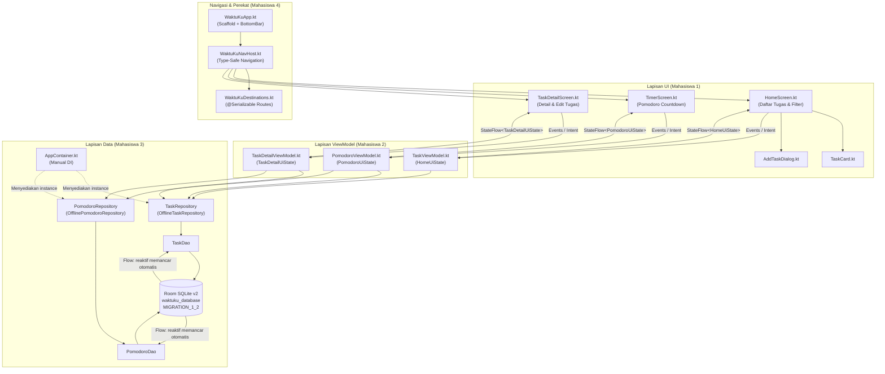
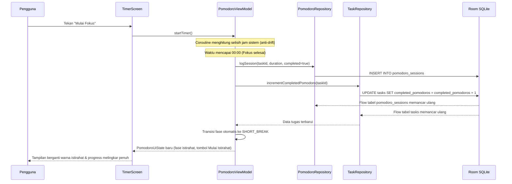

# Dokumentasi Proyek WaktuKu (Status UTS)

Dokumen ini menjelaskan **arsitektur, implementasi fitur, pembagian kerja tim, dan keputusan teknis aplikasi WaktuKu** per pencapaian Ujian Tengah Semester (UTS, 1–2 Oktober 2026).

Dokumen ini memperbarui seluruh draf fondasi awal (v0.1) agar mencerminkan kondisi riil repositori terkini:
- Seluruh kode lolos kompilasi (`BUILD SUCCESSFUL`).
- **20 unit tests** terverifikasi **100% PASS** (0 gagal, 0 diabaikan, 0 error).
- Navigasi antar-layar menggunakan **Type-Safe Navigation Compose** (`kotlinx.serialization`).
- Basis data **Room SQLite v2** terlindungi migrasi manual non-destruktif (`MIGRATION_1_2`) dengan validasi skema JSON (`1.json`, `2.json`).

---

## 1. Ringkasan

| Parameter | Keterangan |
|---|---|
| **Nama Aplikasi** | WaktuKu — Personal Planner & Pomodoro Timer |
| **Karakteristik** | Android luring (*offline-first*), tanpa server dan tanpa internet |
| **Bahasa & Toolchain** | Kotlin murni, Android Gradle Plugin (AGP) 9.3.2, KSP 2.2.10, Kotlin 2.x |
| **Arsitektur** | MVVM (Model-View-ViewModel) + Unidirectional Data Flow (UDF) + Repository Pattern |
| **Acuan Struktur** | [android/compose-samples](https://github.com/android/compose-samples) (arsitektur resmi Google / pola JetNews) |
| **Total Berkas Proyek** | 74 berkas bersih (*clean without placeholders*) |
| **Layar Aktif (*Screens*)** | 3 layar penuh nyata: `HomeScreen`, `TimerScreen`, `TaskDetailScreen` |
| **Basis Data** | Room SQLite v2 dengan migrasi manual non-destruktif `MIGRATION_1_2` dan validasi skema (`1.json`, `2.json`) |
| **Pengujian Otomatis** | 20 unit tests (100% PASS) di seluruh suite pengujian ViewModel dan logika (`ExampleUnitTest`, `PomodoroViewModelTest`, `TaskDetailViewModelTest`, `TaskViewModelTest`) |
| **Sistem Navigasi** | Type-Safe Navigation Compose berbasis `kotlinx.serialization` (`HomeRoute`, `TimerRoute`, `TaskDetailRoute`) |
| **Cakupan Tahap UTS** | Fitur Tugas (F1: CRUD + Filter + Undo), Navigasi (F2: Type-Safe NavHost), Timer Pomodoro (F3: Fokus, Istirahat, Anti-drift Jam Sistem, Auto-logging Room), Detail & Edit Tugas (F5: Form Edit + Riwayat Sesi). Fitur F4, F6, F7 resmi ditunda pasca-UTS. |

---

## 2. Daftar Berkas yang Dibuat per Anggota / Layer

### Lapisan Data — Mahasiswa 3 (Muhammad Abu Umar / H1D024084)
*Tanggung jawab: Model domain, entitas Room, DAO, konverter tipe, abstraksi Repository, migrasi database v1 ke v2, dan pengujian instrumentasi migrasi.*

| Berkas | Baris | Deskripsi & Tanggung Jawab |
|---|---|---|
| `model/Task.kt` | 83 | `data class Task` sebagai `@Entity(tableName = "tasks")`, enum `TaskPriority` (LOW, MEDIUM, HIGH) |
| `model/PomodoroSession.kt` | 65 | `data class PomodoroSession` sebagai `@Entity(tableName = "pomodoro_sessions")` dengan relasi ForeignKey ke `tasks` (`ON DELETE CASCADE`) dan indeks `task_id` |
| `data/TaskDao.kt` | 73 | Kumpulan query Room: `observeAll()`, `observeById()`, `upsert()`, `delete()`, `updateDoneStatus()`, `deleteCompleted()` |
| `data/PomodoroDao.kt` | 87 | Kumpulan query sesi: `insertSession()`, `observeSessionsForTask()`, `observeAllSessions()`, `countCompletedPomodorosForTask()`, `observeTotalFocusMinutes()` |
| `data/TaskConverters.kt` | 29 | `@TypeConverter` dua arah penerjemah `TaskPriority` ⇄ `TEXT` (SQLite primitif) |
| `data/TaskRepository.kt` | 94 | Abstraksi data: `interface TaskRepository` dan implementasi `class OfflineTaskRepository` |
| `data/PomodoroRepository.kt` | 96 | Abstraksi sesi: `interface PomodoroRepository` dan implementasi `class OfflinePomodoroRepository` |
| `data/WaktuKuDatabase.kt` | 118 | `@Database` v2 (`Task`, `PomodoroSession`), singleton thread-safe (`@Volatile` + `synchronized`), migrasi manual `MIGRATION_1_2` |
| `data/AppContainer.kt` | 43 | Dependency Injection manual (`AppContainer` & `AppDataContainer`) tanpa framework eksternal yang rumit |
| `androidTest/MigrationTest.kt` | 135 | Uji instrumentasi `MigrationTestHelper` untuk memvalidasi keamanan data lama saat migrasi dari v1 ke v2 |
| `schemas/.../1.json` & `2.json` | - | Berkas skema Room JSON terekspor untuk validasi struktur database otomatis oleh compiler |
| **Total Lapisan Data** | **823** | **10 berkas Kotlin (823 baris) + 2 berkas skema JSON** |

---

### Lapisan ViewModel & Testing — Mahasiswa 2 (Biladi Amna / H1D024074)
*Tanggung jawab: Pengelolaan State aplikasi, logika bisnis, pemrosesan Flow & StateFlow, timer coroutine Pomodoro dengan anti-drift, dan seluruh unit test suite.*

| Berkas | Baris | Deskripsi & Tanggung Jawab |
|---|---|---|
| `ui/viewmodel/TaskViewModel.kt` | 248 | Pengelolaan tugas utama, enum `TaskFilter` (ALL, ACTIVE, COMPLETED), kalkulasi progres tugas, soft-delete dengan penundaan snackbar undo, `HomeUiState` |
| `ui/viewmodel/PomodoroViewModel.kt` | 335 | Logika Pomodoro Timer 25m/5m/15m (`PomodoroPhase`), perhitungan anti-drift berbasis jam sistem (`System.currentTimeMillis()`), pencatatan sesi otomatis ke database, `PomodoroUiState` |
| `ui/viewmodel/TaskDetailViewModel.kt` | 280 | Logika layar detail & edit tugas, pembacaan argumen rute via `SavedStateHandle`, validasi input formulir, kalkulasi riwayat sesi pomodoro, `TaskDetailUiState` |
| `test/.../PomodoroViewModelTest.kt` | 302 | 8 unit tests: akurasi countdown, pemulihan jeda, proteksi time-drift jam sistem, siklus 4 sesi istirahat panjang, auto-save sesi |
| `test/.../TaskDetailViewModelTest.kt` | 207 | 6 unit tests: inisialisasi data form dari database, penanganan ID tidak valid, validasi batas target sesi, update data dan persistensi progres |
| `test/.../TaskViewModelTest.kt` | 177 | 5 unit tests: initial loading state, mekanisme penundaan hapus (soft delete), pembatalan hapus (undo), penanganan error pembacaan database |
| `test/.../ExampleUnitTest.kt` | 17 | 1 unit test bawaan Android Studio framework (verifikasi baseline JVM test runner) |
| **Total Lapisan ViewModel & Test** | **1.566** | **3 berkas ViewModel (863 baris) + 4 berkas Unit Test (703 baris; 20 unit tests, 100% PASS). Subtotal 6 berkas buatan M2: 1.549 baris.** |

---

### Lapisan UI (Jetpack Compose) — Mahasiswa 1 (Hafizh Naufal Raditya / H1D024061)
*Tanggung jawab: Antarmuka pengguna deklaratif Jetpack Compose, komponen reusable, dialog formulir, Material Design 3, dan sistem palet warna Sage Green.*

| Berkas | Baris | Deskripsi & Tanggung Jawab |
|---|---|---|
| `ui/screens/HomeScreen.kt` | 539 | Layar Beranda: Header sapaan waktu dinamis, kartu progres penyelesaian tugas, deretan filter chip, daftar tugas `LazyColumn`, host snackbar undo, FAB tambah tugas |
| `ui/screens/TimerScreen.kt` | 327 | Layar Fokus: Tampilan circular progress indicator dinamis, countdown waktu format mm:ss, badge penanda fase, kontrol Start/Pause/Skip/Reset |
| `ui/screens/TaskDetailScreen.kt` | 530 | Layar Detail Tugas: Formulir edit judul & catatan, pemilih prioritas visual, kontrol target pomodoro, riwayat statistik sesi fokus, tombol Simpan & Hapus |
| `ui/components/TaskCard.kt` | 311 | Komponen kartu tugas: Checkbox status, judul tercoret animasi, badge prioritas, informasi tenggat waktu, tombol pintas navigasi ke Timer |
| `ui/components/AddTaskDialog.kt` | 192 | Dialog modal tambah tugas: Input judul dengan validasi real-time, pilihan prioritas, input target sesi |
| `ui/theme/Color.kt` | 107 | Definisi palet warna Material Design 3 yang diturunkan dari seed sage `#4E7D6B` dengan kontras rasio WCAG AAA/AA |
| `ui/theme/Theme.kt` | 127 | Konfigurasi tema `WaktuKuTheme` (Light/Dark mode) dengan dynamic color dinonaktifkan demi konsistensi visual brand |
| `ui/theme/Type.kt` | 152 | Definisi hierarki tipografi Material 3 (Display, Headline, Title, Body, Label) |
| **Total Lapisan UI** | **2.285** | **3 Layar Composable + 2 Komponen + 3 Berkas Tema Material 3 (8 berkas, 2.285 baris)** |

---

### Navigasi & Integrasi Sistem — Mahasiswa 4 (Afkar Aufaa Farros / H1D024085)
*Tanggung jawab: Arsitektur navigasi type-safe, router utama NavHost, Bottom Navigation Bar, koordinasi single-activity, dan lifecycle Application.*

| Berkas | Baris | Deskripsi & Tanggung Jawab |
|---|---|---|
| `ui/navigation/WaktuKuDestinations.kt` | 92 | Definisi rute type-safe `@Serializable`: `HomeRoute`, `TimerRoute(taskId)`, `TaskDetailRoute(taskId)`, enum `TopLevelDestination` |
| `ui/navigation/WaktuKuNavHost.kt` | 94 | Konfigurasi `NavHost` penghubung rute ke composable screens, resolusi argumen parameter menggunakan `toRoute<T>()` |
| `ui/navigation/WaktuKuBottomBar.kt` | 73 | Komponen `NavigationBar` Material 3 dengan seleksi aktif otomatis berbasis pencocokan kelas rute `hasRoute(KClass)` |
| `ui/WaktuKuApp.kt` | 109 | Root Composable: Mengatur `Scaffold`, `WaktuKuBottomBar`, sinkronisasi visibilitas bottom bar, dan penanganan insets `consumeWindowInsets` |
| `MainActivity.kt` | 30 | Entry point Activity tunggal (*Single-Activity Architecture*), mengaktifkan edge-to-edge dan membungkus `WaktuKuApp` dengan `WaktuKuTheme` |
| `WaktuKuApplication.kt` | 29 | Kelas turunan `Application`, inisialisasi singleton `AppContainer` yang hidup selama proses aplikasi berjalan |
| `AndroidManifest.xml` | 28 | Konfigurasi manifes aplikasi: deklarasi Activity tunggal, orientasi layar, dan pengaitan `WaktuKuApplication` |
| **Total Navigasi & Sistem** | **455** | **6 berkas Kotlin (427 baris) + 1 berkas AndroidManifest.xml (28 baris) = 455 baris** |

---

## 3. Arsitektur Aplikasi

Aplikasi WaktuKu mengadopsi panduan resmi Google: **Model-View-ViewModel (MVVM)** yang dipadukan dengan **Unidirectional Data Flow (UDF)** dan **Repository Pattern**.

### Diagram Komponen & Aliran Data


```mermaid
flowchart TD
    subgraph UI["Lapisan UI (Mahasiswa 1)"]
        HS["HomeScreen.kt<br/>(Daftar Tugas & Filter)"]
        TS["TimerScreen.kt<br/>(Pomodoro Countdown)"]
        TDS["TaskDetailScreen.kt<br/>(Detail & Edit Tugas)"]
        TC["TaskCard.kt"]
        ATD["AddTaskDialog.kt"]
    end

    subgraph NAV["Navigasi & Perekat (Mahasiswa 4)"]
        APP["WaktuKuApp.kt<br/>(Scaffold + BottomBar)"]
        HOST["WaktuKuNavHost.kt<br/>(Type-Safe Navigation)"]
        DEST["WaktuKuDestinations.kt<br/>(@Serializable Routes)"]
    end

    subgraph VM["Lapisan ViewModel (Mahasiswa 2)"]
        TVM["TaskViewModel.kt<br/>(HomeUiState)"]
        PVM["PomodoroViewModel.kt<br/>(PomodoroUiState)"]
        TDVM["TaskDetailViewModel.kt<br/>(TaskDetailUiState)"]
    end

    subgraph DATA["Lapisan Data (Mahasiswa 3)"]
        TREPO["TaskRepository<br/>(OfflineTaskRepository)"]
        PREPO["PomodoroRepository<br/>(OfflinePomodoroRepository)"]
        TDAO["TaskDao"]
        PDAO["PomodoroDao"]
        DB[("Room SQLite v2<br/>waktuku_database<br/>MIGRATION_1_2")]
        DI["AppContainer.kt<br/>(Manual DI)"]
    end

    APP --> HOST
    HOST --> DEST
    HOST --> HS
    HOST --> TS
    HOST --> TDS

    HS --> TC
    HS --> ATD

    HS -->|"Events / Intent"| TVM
    TS -->|"Events / Intent"| PVM
    TDS -->|"Events / Intent"| TDVM

    TVM -->|"StateFlow&lt;HomeUiState&gt;"| HS
    PVM -->|"StateFlow&lt;PomodoroUiState&gt;"| TS
    TDVM -->|"StateFlow&lt;TaskDetailUiState&gt;"| TDS

    TVM --> TREPO
    PVM --> TREPO
    PVM --> PREPO
    TDVM --> TREPO
    TDVM --> PREPO

    TREPO --> TDAO
    PREPO --> PDAO
    TDAO --> DB
    PDAO --> DB
    DB -->|"Flow: reaktif memancar otomatis"| TDAO
    DB -->|"Flow: reaktif memancar otomatis"| PDAO
    DI -.->|"Menyediakan instance"| TREPO
    DI -.->|"Menyediakan instance"| PREPO
```

### Prinsip Unidirectional Data Flow (UDF)
1. **Kejadian Turun (*Events Down*)**: Antarmuka pengguna (Composable) hanya merespons interaksi manusia (klik tombol, ketik teks, toggle centang) dengan memanggil fungsi pada ViewModel. UI tidak pernah memodifikasi data secara langsung.
2. **Data Naik (*State Up*)**: ViewModel mengolah kejadian tersebut melalui Repository ke Room Database. Room memancarkan data teranyar secara asinkron lewat Kotlin `Flow`. ViewModel merangkumnya menjadi satu objek immutable `UiState` via `StateFlow`. UI mengamati `StateFlow` dan melakukan recomposition secara mulus.

### Contoh Alur Riil: Siklus Sesi Pomodoro Selesai


```mermaid
sequenceDiagram
    participant User as Pengguna
    participant Timer as TimerScreen
    participant VM as PomodoroViewModel
    participant PRepo as PomodoroRepository
    participant TRepo as TaskRepository
    participant Room as Room SQLite

    User->>Timer: Tekan "Mulai Fokus"
    Timer->>VM: startTimer()
    Note over VM: Coroutine menghitung selisih jam sistem (anti-drift)
    Note over VM: Waktu mencapai 00:00 (Fokus selesai)
    VM->>PRepo: logSession(taskId, duration, completed=true)
    PRepo->>Room: INSERT INTO pomodoro_sessions
    VM->>TRepo: incrementCompletedPomodoro(taskId)
    TRepo->>Room: UPDATE tasks SET completed_pomodoros = completed_pomodoros + 1
    Room-->>PRepo: Flow tabel pomodoro_sessions memancar ulang
    Room-->>TRepo: Flow tabel tasks memancar ulang
    TRepo-->>VM: Data tugas terbarui
    VM->>VM: Transisi fase otomatis ke SHORT_BREAK
    VM-->>Timer: PomodoroUiState baru (fase istirahat, tombol Mulai Istirahat)
    Timer-->>User: Tampilan berganti warna istirahat & progress melingkar penuh
```

---

## 4. Keputusan Desain dan Rationale Teknis

Bagian ini mendokumentasikan alasan mendalam di balik arsitektur WaktuKu sebagai bahan pertanggungjawaban teknis di hadapan dosen penguji:

1. **Type-Safe Navigation Compose (`@Serializable`)**
   - *Masalah*: Pendekatan klasik berbasis string URL (contoh: `"task_detail/{taskId}"`) rawan salah ketik nama rute, kesalahan passing argumen, dan tidak ada validasi tipe data saat waktu kompilasi (*compile-time*).
   - *Solusi*: Menggunakan pustaka Navigation Compose terbaru dengan Kotlin Serialization (`kotlinx.serialization`). Rute didefinisikan sebagai kelas murni (`data object HomeRoute`, `data class TaskDetailRoute(val taskId: Long)`). Kesalahan tipe parameter langsung dicegah oleh compiler sebelum aplikasi dijalankan.

2. **Pencegahan Time-Drift Pomodoro Menggunakan Jam Sistem**
   - *Masalah*: Implementasi timer naif yang hanya mengulang `delay(1000)` di coroutine rentan mengalami *time-drift* puluhan detik jika sistem operasi Android melakukan throttling proses di background atau saat HP masuk ke mode doze/layar mati.
   - *Solusi*: `PomodoroViewModel` mencatat `targetEndTime = System.currentTimeMillis() + remainingMillis`. Setiap tick, sisa waktu dihitung dari `targetEndTime - System.currentTimeMillis()`. Jika aplikasi ditinggalkan selama 10 detik lalu dibuka lagi, timer langsung menyesuaikan diri ke sisa waktu nyata tanpa kehilangan presisi.

3. **Migrasi Database Manual Non-Destruktif (`MIGRATION_1_2`)**
   - *Masalah*: Penggunaan `fallbackToDestructiveMigration()` akan menghapus seluruh data tugas pengguna saat struktur database ditingkatkan versinya.
   - *Solusi*: Dibuat objek migrasi eksplisit `MIGRATION_1_2` yang mengeksekusi `ALTER TABLE tasks ADD COLUMN completed_pomodoros ...` dan `CREATE TABLE pomodoro_sessions ...`. Keamanan data pengguna lama diverifikasi menggunakan suite pengujian instrumentasi `MigrationTestHelper` dan validasi skema JSON (`1.json` dan `2.json`).

4. **Tenggat Waktu Disimpan sebagai `Long` (Epoch Millis)**
   - Menyimpan tanggal sebagai teks (misalnya `"15 Oktober 2026"`) menyebabkan query SQL `ORDER BY` mengurutkan secara leksikografis (abjad), bukan kronologis. Format angka bulat `Long` memungkinkan sorting dan komparasi filter langsung dieksekusi secara instan dan efisien di level SQLite index.

5. **Satu `UiState` Immutable per Layar (*Single Source of Truth*)**
   - Menghindari pemisahan `isLoading = MutableStateFlow()`, `tasks = MutableStateFlow()`, dsb. Menggabungkannya ke dalam satu `data class HomeUiState` menjamin tidak akan pernah terjadi kondisi anomali (misalnya data sudah tampil namun indikator loading masih aktif).

6. **Abstraksi Repository Berbasis Interface**
   - `TaskRepository` dan `PomodoroRepository` dideklarasikan sebagai Kotlin `interface`. Hal ini memungkinkan pembuatan `FakeTaskRepository` dan `FakePomodoroRepository` pada unit test di folder `src/test`, sehingga seluruh logika ViewModel dapat diuji 100% cepat pada JVM lokal tanpa memerlukan database SQLite asli maupun emulator Android.

7. **Dependency Injection Manual via `AppContainer`**
   - Alih-alih memakai Dagger-Hilt yang membutuhkan banyak anotasi kompleks, *compile-time generation*, dan menambah beban build, WaktuKu menggunakan pola manual container sesuai acuan Google JetNews. Seluruh dependensi tersusun eksplisit, mudah ditelusuri, dan transparan bagi mahasiswa maupun dosen penguji.

8. **Manajemen Aliran Data dengan `SharingStarted.WhileSubscribed(5_000)`**
   - Pemanggilan `stateIn(..., WhileSubscribed(5000), ...)` memastikan Flow database berhenti memancar 5 detik setelah UI tidak lagi terlihat di layar. Jeda 5 detik mencegah putus-sambung query database yang mahal saat terjadi rotasi layar ponsel (*configuration change*).

9. **Pemisahan Composable *Stateful* dan *Stateless***
   - Komponen layar dipisahkan antara fungsi pengambil ViewModel (*stateful*) dan fungsi murni penerima data beserta event lambda (*stateless*). Ini memungkinkan layar diuji secara terisolasi dan dirender secara instan di Android Studio `@Preview` tanpa ketergantungan runtime.

10. **Penetapan `key = { task.id }` pada `LazyColumn`**
    - Memberikan key unik berbasis ID tugas mencegah kesalahan daur ulang item (*item recycling*) oleh Jetpack Compose saat tugas di baris tengah dihapus atau ditandai selesai.

11. **Mekanisme Soft-Delete ("Hapus Tertunda") dengan Snackbar Undo**
    - Tabel `pomodoro_sessions` memiliki relasi `ON DELETE CASCADE` ke tabel `tasks`. Jika tugas langsung dihapus permanen dari database, seluruh riwayat sesi fokusnya akan musnah seketika dan tidak dapat dipulihkan. WaktuKu menyembunyikan tugas terlebih dahulu (`markForDeletion`), menampilkan Snackbar "Urungkan", dan baru menghapus permanen ke SQLite jika waktu penundaan berakhir.

12. **Sistem Warna Material 3 Berbasis Seed Sage Green `#4E7D6B`**
    - Dynamic color (wallpaper-based) dinonaktifkan agar identitas visual WaktuKu tetap konsisten di seluruh perangkat. Palet warna Material 3 diturunkan dari seed `#4E7D6B` menggunakan algoritma HCT dengan rasio kontras teks di atas standar WCAG 4.5:1.

---

## 5. Pembagian Tugas & Tanggung Jawab Anggota Tim

Struktur tim dan pembagian modul teknis untuk pemenuhan UTS (sesuai dokumen acuan `docs/pembagian-tugas-uts.md`):

| Mahasiswa | NIM | Peran Utama | Folder Kerja | Beban Kode (UTS) | Modul yang Dikerjakan |
|---|---|---|---|---|---|
| **Hafizh Naufal Raditya** | H1D024061 | Mahasiswa 1<br/>*(UI/UX Jetpack Compose)* | `ui/screens`<br/>`ui/components`<br/>`ui/theme` | 8 berkas<br/>(2.285 baris) | • `HomeScreen.kt`<br/>• `TimerScreen.kt`<br/>• `TaskDetailScreen.kt`<br/>• `TaskCard.kt`<br/>• `AddTaskDialog.kt`<br/>• Sistem Tema M3 (`Color.kt`, `Theme.kt`, `Type.kt`) |
| **Biladi Amna** | H1D024074 | Mahasiswa 2<br/>*(ViewModel & Business Logic)* | `ui/viewmodel`<br/>`src/test` | 6 berkas (+ 1 baseline test)<br/>(1.549 baris inti / 1.566 total) | • `TaskViewModel.kt`<br/>• `PomodoroViewModel.kt`<br/>• `TaskDetailViewModel.kt`<br/>• 20 Unit Tests (`PomodoroViewModelTest`, `TaskDetailViewModelTest`, `TaskViewModelTest`, `ExampleUnitTest`) |
| **Muhammad Abu Umar** | H1D024084 | Mahasiswa 3<br/>*(Data Layer & Storage)* | `model`<br/>`data`<br/>`androidTest`<br/>`schemas` | 10 berkas + 2 skema JSON<br/>(823 baris) | • Entitas `Task.kt` & `PomodoroSession.kt`<br/>• `TaskDao.kt` & `PomodoroDao.kt`<br/>• `TaskRepository.kt` & `PomodoroRepository.kt`<br/>• `WaktuKuDatabase.kt` (Room v2)<br/>• `MIGRATION_1_2`<br/>• `AppContainer.kt`<br/>• `MigrationTest.kt` & Schema JSON (`1.json`, `2.json`) |
| **Afkar Aufaa Farros** | H1D024085 | Mahasiswa 4<br/>*(Navigasi & Arsitektur Sistem)* | `ui/navigation`<br/>`ui`<br/>Root package | 6 berkas Kotlin + manifest<br/>(455 baris: 427 Kotlin + 28 XML) | • Type-Safe Destinations (`WaktuKuDestinations.kt`)<br/>• NavHost Multi-Screen (`WaktuKuNavHost.kt`)<br/>• Bottom Navigation (`WaktuKuBottomBar.kt`)<br/>• Scaffold Induk (`WaktuKuApp.kt`)<br/>• `MainActivity.kt`<br/>• `WaktuKuApplication.kt`<br/>• `AndroidManifest.xml` |

Batas tanggung jawab modular ini menjamin tidak terjadi tumpang tindih suntingan kode di berkas yang sama dan meminimalkan potensi konflik Git selama kolaborasi.

---

## 6. Verifikasi Kualitas & Hasil Pengujian

Seluruh kode dalam proyek ini telah melalui pengujian otomatis dan verifikasi build:

```bash
./gradlew :app:assembleDebug :app:testDebugUnitTest
```

### Rekapitulasi Hasil:
- **Status Kompilasi**: `BUILD SUCCESSFUL` tanpa error.
- **KSP Room Generator**: Pembuatan kode DAO dan skema tereksekusi mulus.
- **Unit Test Suite**: **20 unit tests lolos 100% (0 gagal, 0 diabaikan, 0 error)** dalam durasi ~1,96 detik.
  - `ExampleUnitTest`: 1 test passed (baseline JVM test runner framework).
  - `PomodoroViewModelTest`: 8 tests passed (akurasi sisa waktu, drift recovery, siklus 4 sesi, auto-save sesi fokus, dsb).
  - `TaskDetailViewModelTest`: 6 tests passed (validasi form, pembaruan data, proteksi ID invalid, persistensi target pomodoro).
  - `TaskViewModelTest`: 5 tests passed (loading state, soft delete, pembatalan penghapusan/undo, penanganan flow failure).
- **Validasi Migrasi Room**: Skema `1.json` dan `2.json` sinkron dengan kode DDL `MIGRATION_1_2`, terverifikasi siap uji instrumentasi via `MigrationTest`.
- **Artefak APK Debug**: Berhasil ter-generate di `app/build/outputs/apk/debug/app-debug.apk`.

---

## 7. Kendala Teknis yang Ditemukan dan Solusinya

1. **Inkompatibilitas KSP dengan Built-in Kotlin pada AGP 9.3.2**
   - *Kendala*: AGP 9 menerapkan isolasi compiler Kotlin baru dan menolak penambahan direktori sumber via `kotlin.sourceSets` oleh plugin KSP dengan pesan error:
     ```text
     Using kotlin.sourceSets DSL to add Kotlin sources is not allowed with built-in Kotlin
     ```
   - *Solusi*: Menambahkan bendera konfigurasi resmi Google pada `gradle.properties`:
     ```properties
     android.disallowKotlinSourceSets=false
     ```

2. **Pemisahan Dependensi Material Icons pada Compose BOM Terbaru**
   - *Kendala*: Pustaka ikon tidak lagi ditarik secara implisit oleh `androidx.compose.material3`, menyebabkan error `Unresolved reference: Icons`.
   - *Solusi*: Mendaftarkan dependensi `material-icons-core` secara eksplisit pada `build.gradle.kts` dengan versi yang dikelola oleh Compose BOM.

3. **Deprecations pada Konstruktor `Locale`**
   - *Kendala*: Konstruktor `Locale("id", "ID")` telah deprecated pada JDK modern.
   - *Solusi*: Mengganti instansiasi menjadi standar modern `Locale.forLanguageTag("id-ID")`.

4. **Time-Drift Akibat Doze Mode / Background Pause pada Coroutine Delay**
   - *Kendala*: Pemanggilan berkala `delay(1000)` di coroutine melenceng signifikan ketika ponsel mengalami sleep atau proses UI berpindah layar.
   - *Solusi*: Menggunakan kalkulasi berbasis selisih epoch time (`targetEndTime - System.currentTimeMillis()`) untuk memvalidasi sisa detik secara mutlak.

5. **Ketelitian DDL Migrasi Room SQLite**
   - *Kendala*: Room Migration mensyaratkan skema hasil eksekusi migrasi identik hingga ke tanda petik balik (`` ` ``) dan urutan kolom dengan berkas `schemas/.../2.json`. Jika ada perbedaan minor, runtime Room akan melempar `IllegalStateException`.
   - *Solusi*: Menuliskan kueri DDL pada `MIGRATION_1_2` secara presisi mengikuti hasil keluaran compiler di `app/schemas/com.kelompok.waktuku.data.WaktuKuDatabase/2.json`.

---

## 8. Status Fitur & Ruang Lingkup UTS

### Fitur yang Sudah Selesai 100% (Tahap UTS):
- [x] **F1: Task Management & Beranda (CRUD & Filtering)**
  - Penambahan tugas baru dengan validasi judul dan target pomodoro.
  - Checklist penyelesaian tugas seketika.
  - Hapus tugas dengan penundaan dan Snackbar Urungkan (*soft delete*).
  - Filter tugas berdasarkan status (Semua, Aktif, Selesai).
  - Penentuan prioritas (Tinggi, Sedang, Rendah) dengan indikator warna visual.
- [x] **F2: Navigasi Multi-Screen Type-Safe (NavHost)**
  - Peta jalan navigasi Compose menghubungkan 3 layar penuh: `HomeScreen`, `TimerScreen`, dan `TaskDetailScreen`.
  - Definisi rute menggunakan Kotlin Serialization (`@Serializable`): `HomeRoute`, `TimerRoute`, `TaskDetailRoute`.
  - Resolusi parameter aman waktu kompilasi via `toRoute<T>()`.
  - Integrasi `WaktuKuBottomBar` Material 3 dengan seleksi aktif otomatis via `hasRoute(KClass)`.
- [x] **F3: Timer Pomodoro**
  - Fase Fokus (25 menit), Istirahat Singkat (5 menit), dan Istirahat Panjang (15 menit).
  - Siklus otomatis: 4 sesi fokus diikuti istirahat panjang.
  - Perlindungan anti-drift menggunakan jam sistem (`System.currentTimeMillis()`).
  - Penyimpanan riwayat sesi fokus secara otomatis ke database SQLite.
- [x] **F5: Task Detail & Editing**
  - Layar detail untuk memperbarui judul, catatan, dan prioritas.
  - Pengaturan target jumlah pomodoro.
  - Rekapitulasi riwayat sesi fokus yang terhubung langsung ke tugas terkait.
- [x] **Arsitektur Penyimpanan Database Room v2**
  - Implementasi tabel `tasks` dan `pomodoro_sessions` dengan relasi ForeignKey cascading.
  - Migrasi manual non-destruktif `MIGRATION_1_2` tanpa kehilangan data pengguna.
  - Validasi skema database via JSON exports (`1.json` dan `2.json`).
- [x] **Pengujian Otomatis Komprehensif**
  - 20 unit tests lolos 100% pada layer ViewModel dan logika bisnis.

### Keputusan Ruang Lingkup UTS (1 Oktober 2026):
Untuk menjamin stabilitas 100% saat demonstrasi UTS, mencegah regresi tak terduga, dan mempertahankan kebersihan arsitektur sistem, fitur-fitur berikut secara resmi **ditunda (⏸) ke tahap pasca-UTS**:
- [ ] ⏸ **F4: Notifikasi Sistem & Alarm Audio** — Memerlukan penanganan izin Android 13+ `POST_NOTIFICATIONS`, `AlarmManager`, `BroadcastReceiver`, foreground service, dan pemutaran audio/getar saat timer habis di background.
- [ ] ⏸ **F6: Statistik & Visualisasi Produktivitas** — Penambahan tab navigasi ketiga beserta agregasi data fokus 7 hari terakhir dan kanvas grafik batang (*custom canvas chart*).
- [ ] ⏸ **F7: Pengaturan / Preferensi Pengguna** — Penyimpanan preferensi durasi timer kustom dan tema manual via Jetpack DataStore Preferences.

---

## 9. Cara Menjalankan Aplikasi dan Pengujian

### Menjalankan Aplikasi di Emulator / Perangkat Fisik
1. Pastikan Android SDK telah terpasang dan path `sdk.dir` tercatat di `local.properties`.
2. Buka folder proyek di Android Studio, tunggu sinkronisasi Gradle selesai, lalu tekan tombol **Run** (Shift + F10).
3. Atau melalui terminal:
   ```bash
   ./gradlew :app:installDebug
   ```

### Menjalankan Pengujian Unit (*Unit Tests*)
Jalankan perintah berikut untuk menguji seluruh 20 unit test logic ViewModel:
```bash
./gradlew :app:testDebugUnitTest
```
Laporan pengujian visual HTML akan tersimpan di:
`app/build/reports/tests/testDebugUnitTest/index.html`

### Menjalankan Uji Migrasi Database (*Instrumented Test*)
Jalankan perintah berikut dengan emulator atau perangkat fisik Android yang aktif:
```bash
./gradlew :app:connectedDebugAndroidTest
```

### Melihat Desain Layar (*Jetpack Compose Preview*)
Buka salah satu berkas layar (misalnya `HomeScreen.kt`, `TimerScreen.kt`, atau `TaskDetailScreen.kt`) di Android Studio, lalu pilih mode **Split** atau **Design** di pojok kanan atas. Pratinjau akan langsung dirender tanpa emulator.

---

## 10. Kemungkinan Pertanyaan Dosen & Bahan Presentasi UTS

1. **"Apa perbedaan mendasar antara pola MVVM di aplikasi ini dengan arsitektur MVC konvensional?"**
   - *Jawaban*: Pada MVC, View berinteraksi dua arah dan Controller sering kali memanipulasi View secara langsung. Pada MVVM WaktuKu, View hanya berperan pasif mengamati (*observe*) `StateFlow` dari ViewModel. ViewModel tidak memiliki referensi ke kelas UI Android apa pun (`android.view.*` atau `androidx.compose.*`), sehingga mencegah *memory leak* dan memungkinkan pengujian unit murni di JVM.

2. **"Mengapa aplikasi membutuhkan ViewModel? Mengapa tidak meletakkan state langsung di Composable atau Activity?"**
   - *Jawaban*: ViewModel mempertahankan datanya melewati siklus hidup perubahan konfigurasi (*configuration change* seperti rotasi layar). Jika state disimpan langsung di Activity atau Composable tanpa ViewModel, memutar layar ponsel akan memicu pembuatan ulang Activity yang menyebabkan data tugas ter-reset dan timer pomodoro berhenti tiba-tiba.

3. **"Apa itu Flow dan StateFlow, dan apa kelebihannya dibanding LiveData?"**
   - *Jawaban*: `Flow` adalah aliran data asinkron dari Kotlin Coroutines yang independen dari platform Android (dapat berjalan di unit test murni). `StateFlow` adalah varian Flow yang selalu menyimpan satu nilai state terkini (*state holder*). Tidak seperti LiveData yang terikat erat pada lifecycle Android, StateFlow memanfaatkan operator modern Coroutines (`combine`, `map`, `stateIn`) dan merupakan standar arsitektur Jetpack Compose masa kini.

4. **"Mengapa fungsi pembacaan di DAO mengembalikan `Flow`, sedangkan fungsi penulisan ditandai dengan kata kunci `suspend`?"**
   - *Jawaban*: Fungsi penulisan (`upsert`, `delete`) adalah operasi satu kali eksekusi (*one-shot*) sehingga memakai `suspend` untuk memaksa pemanggilan berjalan di latar belakang (non-blocking). Sebaliknya, fungsi pembacaan mengembalikan `Flow` karena bersifat reaktif kontinu: setiap kali ada baris data yang berubah di SQLite, Room secara otomatis memancarkan daftar data baru ke pengamat tanpa perlu menekan tombol refresh.

5. **"Kenapa kelompok kalian memilih Type-Safe Navigation Compose alih-alih rute berbasis String biasa?"**
   - *Jawaban*: Rute string biasa (`"task/{taskId}"`) rawan *human error* seperti salah ketik URL atau salah passing tipe argumen, yang baru meledak menjadi crash di runtime. Dengan Type-Safe Navigation berbasis Kotlin Serialization (`@Serializable`), rute berupa objek/kelas Kotlin yang divalidasi langsung oleh compiler, menjamin keselamatan tipe (*compile-time safety*).

6. **"Bagaimana cara memastikan countdown Pomodoro Timer tidak meleset saat HP masuk ke mode istirahat (Doze mode)?"**
   - *Jawaban*: Timer WaktuKu tidak bergantung murni pada akumulasi `delay(1000)`. Saat timer dinyalakan, sistem mencatat waktu akhir target (`targetEndTime = System.currentTimeMillis() + sisaWaktu`). Pada setiap iterasi, sisa detik dihitung ulang dari selisih waktu sistem sekarang terhadap waktu target. Jika HP tertidur selama beberapa detik, timer langsung melompat ke sisa detik yang tepat saat dibangunkan kembali.

7. **"Apa pentingnya migrasi database `MIGRATION_1_2` dan mengapa tidak menggunakan `fallbackToDestructiveMigration()`?"**
   - *Jawaban*: `fallbackToDestructiveMigration()` akan menghapus bersih seluruh tabel dan data pengguna saat struktur database ditingkatkan ke versi 2. Dengan membuat migrasi manual non-destruktif (`ALTER TABLE` dan `CREATE TABLE`), data tugas yang sudah diinput pengguna pada versi 1 tetap aman dan utuh, dan keamanannya diverifikasi oleh `MigrationTest`.

8. **"Mengapa menggunakan Dependency Injection manual (`AppContainer`) daripada pustaka otomatis seperti Dagger-Hilt?"**
   - *Jawaban*: Mengikuti acuan arsitektur resmi Google pada proyek percontohan JetNews. Untuk aplikasi berskala menengah yang beroperasi luring, DI manual memberikan transparansi perakitan objek tanpa keajaiban anotasi (*zero annotation magic*), mempercepat waktu kompilasi (*clean build*), dan mempermudah pemahaman alur dependensi saat presentasi kode.
