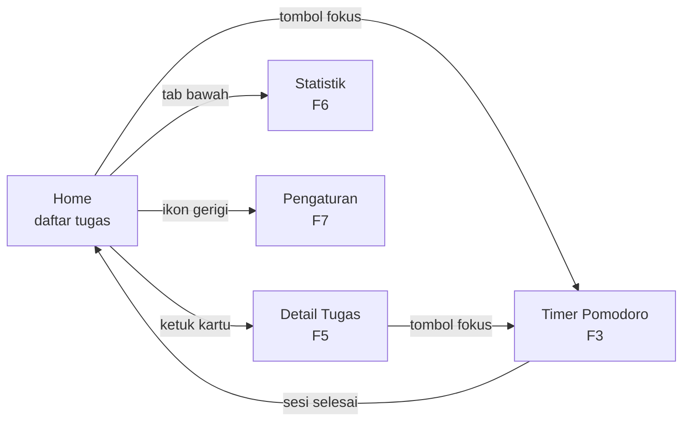

# PRD — WaktuKu

**Product Requirements Document** · versi 1.0 · 2 September 2026
Kelompok 6 — Pemrograman Mobile, Teknik Informatika

Dokumen ini menetapkan **apa yang dibangun dan apa yang tidak** sampai
presentasi akhir. Untuk penjelasan teknis kode yang sudah jadi, lihat
[DOKUMENTASI.md](DOKUMENTASI.md).

---

## 1. Ringkasan

WaktuKu adalah aplikasi Android luring yang menyatukan **perencanaan tugas** dan
**sesi fokus Pomodoro** dalam satu alur. Berbeda dari aplikasi to-do biasa,
setiap sesi fokus di WaktuKu selalu melekat pada satu tugas — sehingga pengguna
tidak hanya tahu *apa yang harus dikerjakan*, tapi juga *berapa banyak fokus yang
sudah ia curahkan* untuk tugas itu.

## 2. Masalah dan pengguna sasaran

**Pengguna sasaran:** mahasiswa yang mengerjakan tugas kuliah, sering berpindah
antar mata kuliah, dan mudah teralihkan.

**Masalah:** perencanaan dan eksekusi biasanya terpisah di dua alat. Daftar tugas
ada di satu aplikasi, timer fokus di aplikasi lain, dan keduanya tidak pernah
saling bicara. Akibatnya pengguna punya daftar panjang tanpa tahu tugas mana yang
sebenarnya sudah ia kerjakan dengan sungguh-sungguh.

**Solusi WaktuKu:** satu aplikasi, satu database, satu alur — pilih tugas, tekan
fokus, dan hasilnya tercatat pada tugas tersebut.

## 3. Prinsip produk

Empat aturan yang dipakai untuk memutuskan saat ada perdebatan fitur:

1. **Luring sepenuhnya.** Tanpa akun, tanpa server, tanpa izin internet. Aplikasi
   harus berfungsi penuh dalam mode pesawat.
2. **Setiap sesi fokus terikat pada satu tugas.** Tidak ada sesi mengambang.
3. **Sekali ketuk untuk mulai fokus.** Dari daftar tugas ke timer berjalan
   maksimal dua ketukan.
4. **Tidak menyimpan data pribadi apa pun** selain isi tugas buatan pengguna
   sendiri.

---

## 4. Ruang lingkup

### 4.1 Sudah selesai (v0.1 — kick-off, terverifikasi `BUILD SUCCESSFUL`)

- Tambah, centang, hapus tugas
- Judul, catatan, prioritas, tenggat, target jumlah sesi
- Penyaring: Semua / Belum selesai / Selesai
- Penyimpanan lokal Room, bertahan setelah aplikasi ditutup
- Arsitektur MVVM lengkap dengan `StateFlow`

### 4.2 Masuk MVP

| Kode | Fitur | Prioritas | PIC utama |
|---|---|---|---|
| F1 | Home diperbarui: ketuk kartu, tombol mulai fokus, progres sesi | **P0** | M1 + M2 |
| F2 | Navigasi antar layar (`NavHost`) | **P0** | M4 |
| F3 | Timer Pomodoro terikat tugas | **P0** | M2 + M3 |
| F4 | Notifikasi saat sesi berakhir | **P0** | M4 |
| F5 | Detail / edit tugas | P1 | M1 + M3 |
| F6 | Statistik sederhana | P2 | M3 + M1 |
| F7 | Pengaturan durasi & tema | P3 | M4 + M1 |

### 4.3 Di luar lingkup — tidak dikerjakan semester ini

Ditulis eksplisit supaya tidak ada perdebatan di tengah jalan:

- Sinkronisasi cloud, akun pengguna, login
- Berbagi atau kolaborasi tugas antar pengguna
- Tugas berulang (harian/mingguan)
- Integrasi kalender sistem
- Widget layar utama dan Wear OS
- Ekspor/impor data
- Dukungan lebih dari satu bahasa
- Suara alarm kustom (cukup nada notifikasi bawaan sistem)

---

## 5. Peta layar



Navigasi utama memakai **bottom navigation** tiga tab: Beranda, Fokus, Statistik.
Pengaturan dicapai lewat ikon gerigi di TopAppBar, bukan tab tersendiri —
frekuensi pemakaiannya rendah.

---

## 6. Kebutuhan fungsional

Format tiap fitur: user story, lalu kriteria penerimaan yang bisa dicentang.
Sebuah fitur baru boleh disebut "selesai" kalau **semua** kriterianya terpenuhi.

### F1 — Home diperbarui · P0

> Sebagai mahasiswa, saya ingin melihat berapa sesi fokus yang sudah saya
> curahkan pada tiap tugas, agar tahu tugas mana yang sebenarnya terbengkalai.

- [ ] Kartu tugas menampilkan progres sesi, contoh "2/4 sesi"
- [ ] Setiap kartu punya tombol mulai fokus yang langsung membuka Timer dengan
      tugas tersebut
- [ ] Mengetuk badan kartu membuka layar Detail Tugas
- [ ] Mencentang tugas tetap berfungsi seperti sebelumnya
- [ ] Tugas yang sudah selesai tidak menampilkan tombol fokus

### F2 — Navigasi · P0

> Sebagai pengguna, saya ingin berpindah antar Beranda, Fokus, dan Statistik
> tanpa kehilangan posisi saya.

- [ ] `NavHost` dengan rute: `home`, `task/{taskId}`, `timer/{taskId}`, `stats`, `settings`
- [ ] Bottom navigation tiga tab, tab aktif ditandai jelas
- [ ] Tombol kembali perangkat berperilaku wajar (tidak keluar aplikasi dari
      layar dalam)
- [ ] Memutar layar tidak mengembalikan pengguna ke Beranda

### F3 — Timer Pomodoro · P0

> Sebagai mahasiswa, saya ingin menjalankan sesi fokus 25 menit untuk satu tugas,
> agar bisa bekerja tanpa terganggu.

- [ ] Hitung mundur menampilkan menit:detik dan indikator lingkaran progres
- [ ] Tombol Mulai, Jeda, Lanjut, dan Hentikan
- [ ] Judul tugas yang sedang dikerjakan tampil di layar timer
- [ ] Siklus otomatis: 4 sesi fokus diselingi istirahat pendek, lalu istirahat panjang
- [ ] **Waktu tetap akurat walau aplikasi ditutup atau layar dimatikan**
- [ ] Sesi yang selesai penuh tersimpan ke database dan menambah progres tugas
- [ ] Sesi yang dihentikan di tengah jalan **tidak** dihitung

### F4 — Notifikasi · P0

> Sebagai pengguna, saya ingin diberi tahu saat sesi berakhir walau sedang
> membuka aplikasi lain.

- [ ] Notifikasi muncul saat sesi fokus maupun istirahat berakhir
- [ ] Izin `POST_NOTIFICATIONS` diminta saat runtime pada Android 13 ke atas
- [ ] Aplikasi tetap berjalan wajar bila pengguna menolak izin notifikasi
- [ ] Mengetuk notifikasi membuka kembali layar Timer

### F5 — Detail / edit tugas · P1

> Sebagai pengguna, saya ingin memperbaiki tugas yang sudah dibuat.

- [ ] Mengubah judul, catatan, prioritas, tenggat, dan target sesi
- [ ] Memilih tanggal tenggat lewat `DatePicker`
- [ ] Tombol simpan nonaktif bila judul kosong
- [ ] Tombol hapus dengan dialog konfirmasi
- [ ] Riwayat sesi fokus untuk tugas itu ditampilkan

### F6 — Statistik sederhana · P2

> Sebagai mahasiswa, saya ingin melihat rekap fokus saya minggu ini, agar tahu
> apakah kebiasaan belajar saya membaik.

- [ ] Total sesi fokus dan total menit hari ini
- [ ] Diagram batang 7 hari terakhir
- [ ] Jumlah tugas selesai minggu ini
- [ ] Tampilan kosong yang jelas bila belum ada data sama sekali

### F7 — Pengaturan · P3

> Sebagai pengguna, saya ingin menyesuaikan durasi karena 25 menit tidak cocok
> untuk semua orang.

- [ ] Durasi fokus, istirahat pendek, dan istirahat panjang dapat diubah
- [ ] Sakelar mode gelap: ikut sistem / terang / gelap
- [ ] Sakelar notifikasi
- [ ] Pengaturan tersimpan dan bertahan setelah aplikasi ditutup

---

## 7. Spesifikasi perilaku Pomodoro

Bagian ini sengaja dirinci karena paling banyak menimbulkan bug.

**Durasi bawaan:** fokus 25 menit · istirahat pendek 5 menit · istirahat panjang
15 menit · istirahat panjang muncul setelah 4 sesi fokus.

**Status timer:** `IDLE` → `FOCUS` → `SHORT_BREAK` / `LONG_BREAK`, dengan
`PAUSED` sebagai status sisipan.

**Aturan paling penting — jangan menghitung tick.**
Timer **tidak boleh** dibuat dengan cara mengurangi satu detik tiap detik. Kalau
begitu, saat layar mati atau Android menidurkan proses, hitungannya melenceng.
Yang benar: simpan **kapan sesi seharusnya berakhir** (`targetEndMillis`), lalu
sisa waktu selalu dihitung ulang sebagai `targetEndMillis - System.currentTimeMillis()`.
Dengan cara ini waktu tetap akurat walau aplikasi sempat ditutup.

**Kapan sesi dicatat:** hanya sesi fokus yang **selesai penuh** yang disimpan ke
tabel dan menambah `completedPomodoros` pada tugas. Sesi yang dihentikan di
tengah tidak dicatat, supaya statistik tidak menipu penggunanya sendiri.

---

## 8. Perubahan model data

Entity baru:

```kotlin
@Entity(tableName = "pomodoro_sessions")
data class PomodoroSession(
    @PrimaryKey(autoGenerate = true) val id: Long = 0L,
    @ColumnInfo(name = "task_id") val taskId: Long,   // sesi selalu milik satu tugas
    @ColumnInfo(name = "started_at") val startedAt: Long,
    @ColumnInfo(name = "duration_minutes") val durationMinutes: Int,
    @ColumnInfo(name = "is_completed") val isCompleted: Boolean,
)
```

Perubahan pada `Task`: tambah kolom `completed_pomodoros: Int = 0`.

**Konsekuensi yang wajib diingat:** menambah tabel dan kolom berarti versi
database naik dari 1 ke 2. Sebelum aplikasi dipakai orang lain,
`fallbackToDestructiveMigration` harus diganti dengan `Migration` yang benar,
kalau tidak seluruh tugas pengguna akan terhapus saat pembaruan.

---

## 9. Prioritas dan urutan potong

Kalau waktu ternyata tidak cukup, **potong dari bawah**, jangan mengerjakan semua
setengah jadi:

```
potong pertama  →  F7 Pengaturan       (durasi tetap 25/5/15, tema ikut sistem)
potong kedua    →  F6 Statistik        (Home sudah menampilkan progres per tugas)
potong ketiga   →  F5 Detail/edit      (pengguna bisa hapus lalu buat ulang)
JANGAN dipotong →  F1-F4               (tanpa ini aplikasi bukan "WaktuKu")
```

Aplikasi dengan empat fitur yang mulus jauh lebih baik dinilai daripada tujuh
fitur yang setengahnya error saat demo.

---

## 10. Rencana kerja 4 minggu

| Minggu | Mahasiswa 1 (UI) | Mahasiswa 2 (ViewModel) | Mahasiswa 3 (Data) | Mahasiswa 4 (Navigasi & Sistem) |
|---|---|---|---|---|
| 1 | Kerangka `TimerScreen` | `PomodoroViewModel` berbasis `targetEndMillis` | `PomodoroSession`, DAO, Migration 1→2 | `NavHost` + bottom navigation (F2) |
| 2 | Timer tampil penuh, Home diperbarui (F1) | Sambungkan timer ke repository | `PomodoroRepository`, query statistik | Notifikasi + izin `POST_NOTIFICATIONS` (F4) |
| 3 | Layar Detail/edit (F5) | Logika edit + validasi | Query rekap 7 hari | `DataStore` untuk Pengaturan (F7) |
| 4 | Statistik (F6) | Perbaikan bug, unit test `TaskViewModel` | Uji Migration, rapikan dokumentasi | Layar Pengaturan, uji navigasi & tombol kembali |

Titik sinkronisasi: **akhir minggu 1**, pastikan `NavHost` (M4) dan
`PomodoroSession` (M3) sudah bertemu, karena keduanya menahan pekerjaan M1 dan M2.

---

## 11. Kriteria selesai untuk demo

Skenario tiga menit yang harus berjalan mulus tanpa error:

1. Buka aplikasi, tambah tugas baru "Belajar UTS Basis Data", prioritas Tinggi, target 4 sesi
2. Ketuk tombol fokus pada tugas itu — timer terbuka dan mulai berjalan
3. Kunci layar 10 detik, buka lagi — hitungan tetap akurat, tidak melompat
4. Percepat sesi (mode demo) hingga selesai — notifikasi muncul, progres tugas jadi "1/4 sesi"
5. Buka Statistik — sesi tadi tercatat
6. Tutup paksa aplikasi, buka lagi — semua data masih ada
7. Centang tugas sebagai selesai — pindah ke penyaring "Selesai"

Sediakan **mode demo** dengan durasi dipersingkat (misal 10 detik) supaya tidak
perlu menunggu 25 menit di depan dosen. Ini trik presentasi yang sah dan justru
menunjukkan kalian paham kodenya.

---

## 12. Risiko

| Risiko | Dampak | Penanganan |
|---|---|---|
| Timer melenceng saat layar mati | Fitur inti terlihat rusak saat demo | Pakai `targetEndMillis`, bukan hitungan tick. Uji dengan mengunci layar |
| Migration Room salah | Data hilang, atau aplikasi crash saat dibuka | Tulis Migration 1→2 di minggu 1, uji dengan `room-testing` yang sudah terpasang |
| Izin notifikasi ditolak di Android 13+ | Notifikasi tidak muncul, dikira bug | Minta izin saat runtime, dan pastikan aplikasi tetap wajar bila ditolak |
| Tiga orang bekerja di file yang sama | Konflik Git berulang | Hormati batas folder tiap anggota; buat branch per fitur |
| Fitur ditambah di tengah jalan | Tidak ada yang selesai | Bagian 4.3 sudah menutup pintu ini. Perubahan lingkup harus disepakati bertiga |
